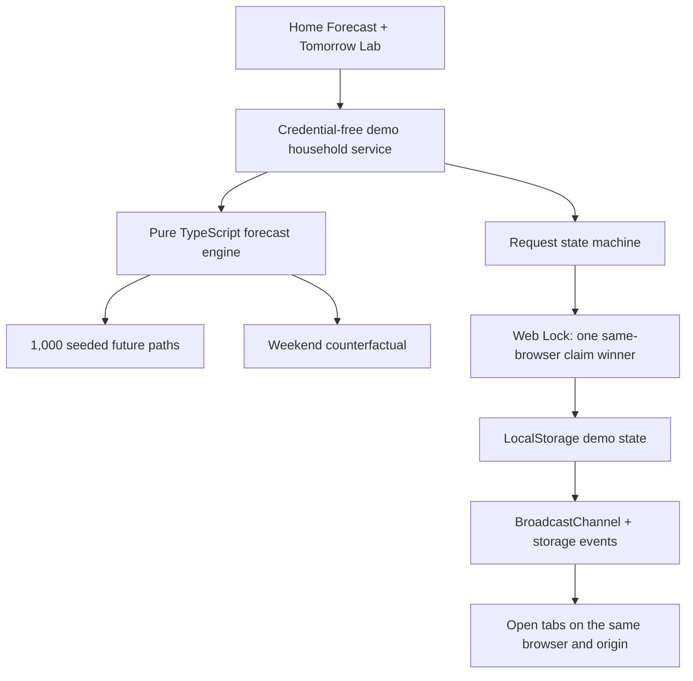

# Milk Tomorrow

> **The shopping list that writes itself—before the milk is gone.**

[](https://yo4e.github.io/Milk-Tomorrow/)

Milk Tomorrow forecasts when an everyday household supply is likely to run short, recommends a practical purchase quantity, and lets one family member claim the restocking task. The surface is intentionally simple enough for a child or a busy parent; underneath it runs a timezone-aware, seeded Monte Carlo demand simulation.

- **Live demo:** [yo4e.github.io/Milk-Tomorrow](https://yo4e.github.io/Milk-Tomorrow/)
- **HackSocial 2026 submission:** [devpost.com/software/milk-tomorrow](https://devpost.com/software/milk-tomorrow)
- **Submission record and project story:** [DEVPOST_SUBMISSION.md](DEVPOST_SUBMISSION.md)
- **Submission verification record:** [HACKSOCIAL_2026_CHECKLIST.md](HACKSOCIAL_2026_CHECKLIST.md)
- **License:** [MIT](LICENSE)

## HackSocial 2026 submission

Milk Tomorrow was submitted on **August 27, 2026 (JST)** for HackSocial 2026, targeting the **Lifestyle Hacks Track**. The public submission, live demo, source repository, disclosures, and gallery assets remain available for judging.

## Why it exists

Shared shopping lists usually start after somebody notices an empty shelf. Households still encounter two familiar failures:

1. Nobody buys the milk because everyone assumes somebody else will.
2. Several people buy it because they notice the shortage independently.

Milk Tomorrow moves the decision earlier. It models a household rhythm from purchase events and friendly consumption presets, forecasts a shortage, and coordinates the response without asking anyone to log every glass of milk.

## What reviewers can verify now

- A polished mobile-first, desktop-friendly Home Forecast with a reproducible **89%** weekend shortage scenario.
- A real **1,000-trial** probabilistic simulation, not a hard-coded chart.
- Per-person weekday/weekend participation and serving-size variation.
- A **340 ml** safety reserve, so “running short” is earlier and more honest than literal zero.
- A 90th-percentile, 48-hour supply plan rounded to whole packages.
- A seeded weekend counterfactual that explains the visible **+7 point** effect.
- One-tap “I’ll get it” coordination serialized with Web Locks in supported browsers.
- Same-browser tab updates through BroadcastChannel with a storage-event fallback.
- Purchase completion that adds two 1 L bottles and recalculates the seeded near-term risk to **0%**.
- Responsible “We still have some” feedback: record the observation, pause for 12 hours, make a bounded adjustment, and never invent an exact remaining amount.
- A **Tomorrow Lab** with time travel, household-member switching, activity history, model assumptions, and reset.
- Eleven deterministic domain tests and a credential-free public Demo Mode.
- Responsive layouts, semantic controls, live status announcements, visible focus styles, and reduced-motion support.

## Try the complete loop

No account, API key, database, or environment variable is required.

```bash
cd app
npm ci
npm run dev
```

Open the printed local URL. The normal route is the responsive web app; add `?preview=phone` for the calibrated iPhone/Pixel device simulator used in visual QA.

1. Read the Friday forecast: `89%` risk and `2 bottles` recommended.
2. Open **See the 1,000 simulated futures** to inspect the model and demo clock.
3. Open a second tab and select a different household member in Tomorrow Lab.
4. Tap **I’ll get it** in one tab. Both tabs show the same assignee and only one claim can win when Web Locks is available.
5. As the winner, tap **Bought 2 bottles**. Both tabs update and the seeded near-term risk falls to `0%`.
6. Reset, tap **We still have some**, then **Move to tonight**. The observation changes the estimate conservatively; it does not dismiss the forecast forever.

## How the forecast works

For each simulated hour and household member, Milk Tomorrow samples a consumption event with probability:

```text
P(event) = member_probability(day_kind) × hourly_consumption_weight
```

When an event occurs, its portion is sampled around the member's mean with bounded normal variation:

```text
portion = mean_portion × clamp(1 + Normal(0, variation), 0.55, 1.60)
```

The forecast runs 1,000 future paths. At horizon `H`, with estimated stock `S` and safety reserve `R = 340 ml`:

```text
risk(H) = count(S_H ≤ R) / 1,000
```

The recommendation covers the 90th-percentile 48-hour consumption path, restores the reserve, subtracts current stock, and rounds up to whole 1 L bottles. A second simulation replaces weekend probabilities with weekday probabilities; its difference from the baseline explains the weekend effect.

The public demo uses a fixed clock and seed (`260821`) so reviewers can reproduce the same evidence. The engine itself remains sensitive to time, stock, household profile, purchase events, observations, and timezone.

## Architecture



The domain engine is independent of React and hosting. Demo Mode deliberately keeps shared state inside one browser so the artifact is immediately testable without credentials. A production household service should put the same transitions behind server-authoritative persistence and realtime updates; browser locks are not a cross-device substitute.

## HackSocial 2026 fit

Milk Tomorrow targets the **Lifestyle Hacks Track** because it removes a recurring day-to-day household friction: noticing a likely shortage, deciding how much to buy, and making sure exactly one person has the trip covered.

| Official judging criterion | Evidence in the working prototype |
|---|---|
| Technical Execution | Seeded simulation, quantiles, counterfactuals, timezone logic, a tested state machine, Web Locks, tab synchronization, and eleven domain tests. |
| Innovation & Creativity | Turns the shopping list from a reactive note into a forecast-generated action before the shelf is empty. |
| User Interface and Design | `89% → 2 bottles → I’ll get it` on the main screen, with model evidence progressively disclosed in Tomorrow Lab. |

Submission requirements and final verification are recorded in [HACKSOCIAL_2026_CHECKLIST.md](HACKSOCIAL_2026_CHECKLIST.md).

## Repository map

```text
app/src/domain/forecast.ts       Monte Carlo forecast and counterfactual
app/src/domain/coordination.ts   Idempotent request and claim state machine
app/src/demo/useDemoHousehold.ts Seeded clock, feedback, and tab coordination
app/src/Prototype.tsx            Home Forecast and Tomorrow Lab
app/tests/domain/                Eleven deterministic domain tests
app/design-qa.md                 Source-vs-rendered design QA evidence
submission-assets/               Reusable gallery and social artwork
DEVPOST_SUBMISSION.md            Submitted HackSocial 2026 story and submission record
HACKSOCIAL_2026_CHECKLIST.md     Submission requirements and verification record
VIDEO_SCENARIO.md                Optional 2:50 demo-video master and shorter cuts
DESIGN.md                        Product and implementation design
IMPLEMENTATION_NOTES.md          Implementation guidance
DEPLOYMENT_NOTES.md              Current public demo and production upgrade path
```

## Verification

```bash
cd app
npm test
npm run check:runtime
npm run build
npm run test:sites
```

The domain suite covers reproducibility, purchase impact, time-travel stock aging, weekend lift, reserve crossing, package rounding, timezone boundaries, claim concurrency, request idempotency, claimant-only completion, and snooze/reopen behavior.

## Responsible delivery and current limitations

- Forecasts are probabilities, not promises; “running short” means crossing a 340 ml safety reserve.
- The public scenario is fixed to a fictional Sakura household with synthetic profiles and a reproducible demo clock.
- A binary observation never becomes a fabricated stock measurement.
- Demo synchronization is same-browser and same-origin only, not cross-device household persistence.
- Authentication, server-authoritative persistence, scheduled forecasts, notifications, and signed actions are roadmap items, not current capabilities.
- Inventory is inferred from seeded stock, purchase events, and coarse feedback; the app does not observe the refrigerator.
- The household and milk profile are fixed in this narrow prototype. Onboarding and additional consumables are future work.
- Demo Mode collects no account, precise location, receipt, credential, or real household data.

## Participant and tool disclosure

- **山田佳江** originated and directed the product concept, selected the visual direction, made product and technical-priority decisions, tested the experience, and owns the submission and presentation.
- OpenAI Codex assisted with implementation, testing, browser verification, and documentation under human direction.
- OpenAI image generation created the design directions and fictional milk, cloud, family, and submission artwork. No real person's likeness or personal data was used.
- The product design documents credit 月野さん for the initial written product design.
- React, React DOM, TypeScript, Vite, Radix UI, Motion, `@use-gesture/react`, Fontsource packages, Playwright tooling, and the Codex Product Design mobile runtime are third-party dependencies or templates.
- Credential-free Demo Mode uses no external API or dataset.

AI tools are disclosed as tools, not listed as team members. The participant remains responsible for the project's accuracy, licensing, privacy, security, and behavior.

## License

Milk Tomorrow is available under the [MIT License](LICENSE). Copyright © 2026 Yoshie Yamada.

## Next production step

Keep the credential-free demo as a reliable review fallback, then add server-authoritative household state, atomic cross-device claims, realtime updates, scheduled forecasts, and signed notification actions. Those adapters should reuse the tested domain engine rather than replace the judgeable model.
