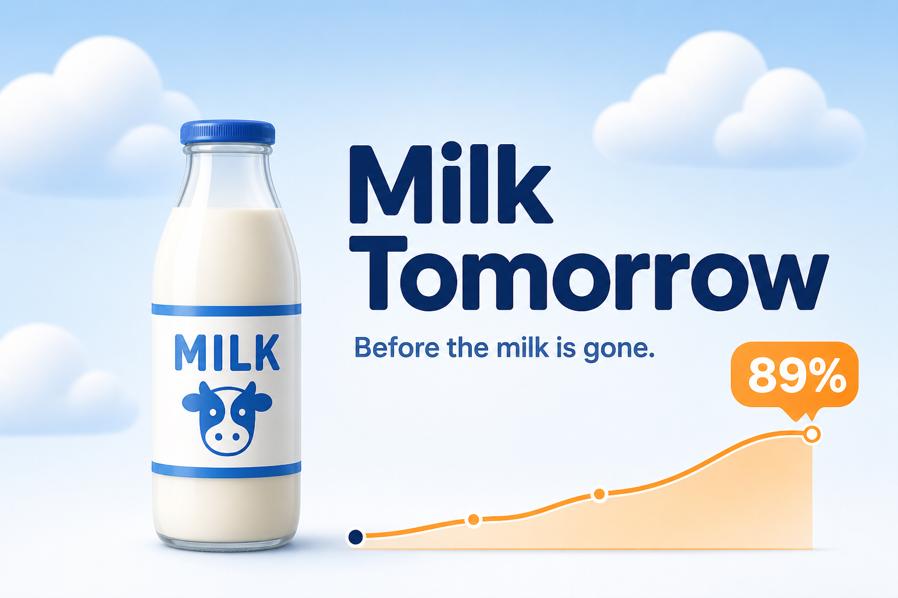
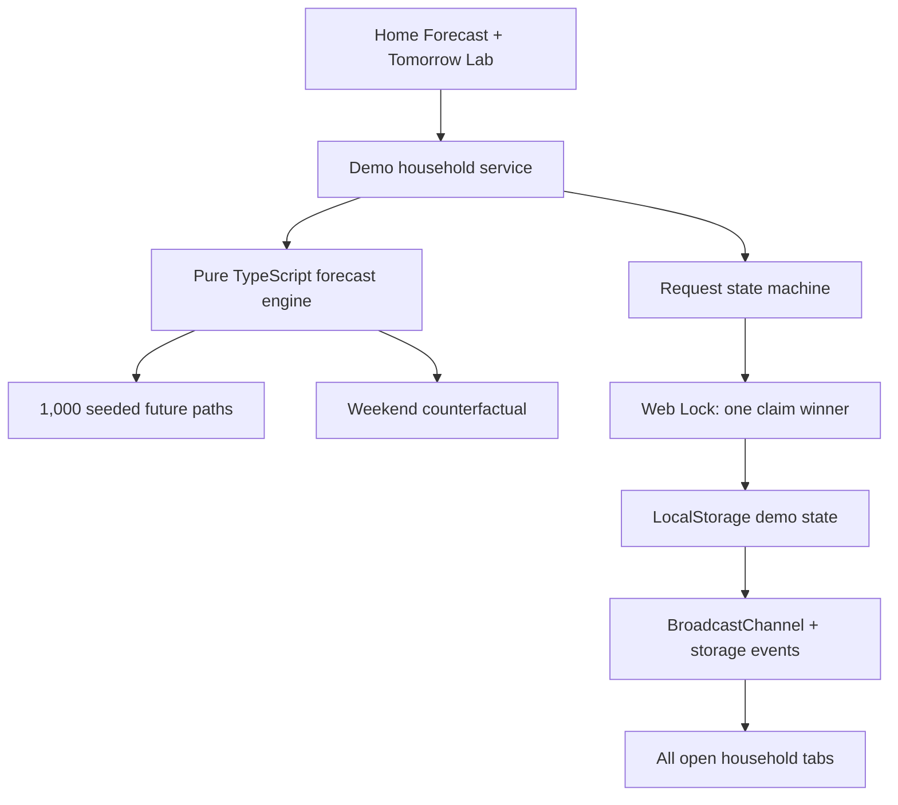

# Milk Tomorrow

> **The shopping list that writes itself—before the milk is gone.**

[](https://yo4e.github.io/Milk-Tomorrow/)

Milk Tomorrow forecasts when everyday household supplies are likely to run short, recommends a practical purchase quantity, and lets exactly one family member claim the restocking task. The surface is intentionally simple enough for a child or a busy parent; underneath it runs a timezone-aware, seeded Monte Carlo demand simulation.

Built for [Proof of Possible 2026](https://proof-of-possible-2026.devpost.com/).

**Live demo:** [yo4e.github.io/Milk-Tomorrow](https://yo4e.github.io/Milk-Tomorrow/)

## Participant contribution

**山田佳江** — originated and directed the product concept, selected the visual direction, made product and technical-priority decisions, tested the experience, and owns the submission and presentation.

## Why it exists

Shared shopping lists start after someone notices an empty shelf. Households still encounter two familiar failures:

1. Nobody buys the milk because everyone assumes somebody else will.
2. Several people buy it because they notice the shortage independently.

Milk Tomorrow moves the decision earlier. It learns a rough household rhythm from purchase events and friendly consumption presets, forecasts the next shortage, and coordinates the response without asking anyone to log every glass of milk.

## What works now

- A polished mobile-first, desktop-friendly Home Forecast with a reproducible **89%** weekend shortage scenario.
- A real **1,000-trial** probabilistic simulation, not a hard-coded chart.
- Per-person weekday/weekend participation and serving-size variation.
- A safety-reserve definition of “running short,” so the app warns before literal zero.
- A 90th-percentile supply plan that rounds recommendations to whole packages.
- A counterfactual weekend calculation (`+7 points` in the seeded demo).
- Atomic-style “I’ll get it” coordination across tabs using Web Locks.
- Instant shared updates through BroadcastChannel with a storage-event fallback.
- Purchase completion that adds two bottles and recalculates near-term risk to **0%**.
- Responsible “We still have some” feedback: record the observation, snooze for 12 hours, make a bounded adjustment, and never invent an exact remaining amount.
- A judge-facing **Tomorrow Lab** with time travel, household-member switching, activity history, model assumptions, and reset.
- Responsive iPhone and Pixel 10 layouts, semantic controls, live status announcements, visible focus styles, and reduced-motion support.

## Try the complete loop

```bash
cd app
npm ci
npm run dev
```

Open the printed local URL. No account, API key, database, or environment variable is required for Demo Mode.

The normal URL is the responsive web app. Add `?preview=phone` when you want the calibrated iPhone/Pixel device simulator used for visual QA.

1. Read the Friday forecast: `89%` risk and `2 bottles` recommended.
2. Open **See the 1,000 simulated futures** to inspect the model and demo clock.
3. Open the app in a second tab and select a different household member in Tomorrow Lab.
4. Tap **I’ll get it** in one tab. Both tabs immediately show the same assignee; only one claim can win.
5. As the winner, tap **Bought 2 bottles**. Both tabs update and near-term risk falls to `0%`.
6. Reset, tap **We still have some**, then **Move to tonight** to see estimated stock age with elapsed time and the alert re-evaluate instead of being dismissed forever.

## The mathematical core

For every simulated hour and household member, Milk Tomorrow samples a consumption event with probability:

```text
P(event) = member_probability(day_kind) × hourly_consumption_weight
```

If an event occurs, the portion is sampled around that member's mean with bounded normal variation:

```text
portion = mean_portion × clamp(1 + Normal(0, variation), 0.55, 1.60)
```

The forecast runs 1,000 future paths. At horizon `H`, with estimated stock `S` and a one-breakfast reserve `R = 340 ml`:

```text
risk(H) = count(S_H ≤ R) / 1,000
```

The purchase recommendation covers the 90th-percentile 48-hour consumption path, restores the reserve, subtracts current stock, and rounds up to whole 1 L bottles. A second counterfactual simulation replaces weekend probabilities with weekday probabilities; its difference from the baseline explains the visible weekend effect.

The demo uses a fixed seed (`260821`) so judges always see the same evidence. The model itself remains sensitive to time, stock, household profile, purchase events, observations, and timezone.

## Architecture



The domain engine is independent of React and hosting. Demo Mode intentionally keeps shared state inside one browser so the artifact is immediately testable without credentials. A production version should put the same state transitions behind a server-authoritative Postgres transaction and realtime channel; browser locks are not a cross-device substitute.

## Repository map

```text
app/src/domain/forecast.ts       Monte Carlo forecast and counterfactual
app/src/domain/coordination.ts   Idempotent request and claim state machine
app/src/demo/useDemoHousehold.ts Seeded clock, feedback, and tab coordination
app/src/Prototype.tsx            Home Forecast and Tomorrow Lab
app/tests/domain/                Deterministic domain tests
app/design-qa.md                 Source-vs-rendered design QA evidence
submission-assets/               Devpost thumbnail and social-preview artwork
DESIGN.md                        Original product design
IMPLEMENTATION_NOTES.md          Notification and data-model guidance
DEPLOYMENT_NOTES.md              Production deployment direction
DEVPOST_SUBMISSION.md            Submission copy and three-minute demo script
```

## Submission assets

- [Devpost gallery thumbnail](submission-assets/milk-tomorrow-thumbnail.png) — 3:2 PNG, ready to upload.
- [GitHub/social preview](submission-assets/milk-tomorrow-social-preview.png) — 1200 × 630 PNG.
- [Responsive app screenshot](app/design/implementation-home-forecast-393x852.jpg) — the initial judge-facing state.
- [Devpost story and demo script](DEVPOST_SUBMISSION.md) — paste-ready submission copy with the remaining checklist.

## Verification

```bash
cd app
npm test
npm run check:runtime
npm run build
npm run test:sites
```

The domain suite covers reproducibility, purchase impact, time-travel stock aging, weekend lift, reserve crossing, package rounding, timezone boundaries, claim concurrency, request idempotency, claimant-only completion, and snooze/reopen behavior.

## Responsible delivery

- Forecasts are labeled as probabilities, not promises.
- “Running short” is explicitly defined as crossing a 340 ml safety reserve.
- The UI exposes the model assumptions and trial count.
- A binary observation never becomes a fabricated stock measurement.
- The demo uses a fictional Sakura household and synthetic consumption profiles.
- No personal data, precise location, receipt, account, or credential is collected.
- The seeded demo is reproducible and its limitations are stated below.

## Current limitations

- Demo synchronization is same-browser and same-origin only. It proves concurrency behavior but is not cross-device household persistence.
- Real authentication, Postgres transactions, realtime subscriptions, scheduled forecasts, and signed email actions are not connected yet.
- Inventory is inferred from seeded stock, purchase events, and coarse feedback; the model does not observe the refrigerator directly.
- The household and milk profile are fixed in this judge-facing slice; onboarding and additional consumables are future work.
- A manual hardware-keyboard pass should be repeated after deployment because the protected desktop phone preview emulates touch input.

## What was created during the hackathon

At the start of implementation, this repository contained the three planning documents at the root and no application code. The complete `app/` prototype, simulation and coordination engines, tests, generated visual assets, responsive interface, Tomorrow Lab, and QA evidence were created during the hackathon build.

## AI and third-party disclosure

- **AI-assisted development:** OpenAI Codex helped translate the supplied design into code, implement and test the simulation, exercise browser states, and draft documentation. The human participant directed the product and selected the final visual direction.
- **Generated visuals:** OpenAI image generation was used for the design directions, milk bottle, cloud, fictional-family artwork, and submission thumbnail. No real person's likeness or personal data was used.
- **Pre-existing product work:** `DESIGN.md`, `IMPLEMENTATION_NOTES.md`, and `DEPLOYMENT_NOTES.md` were supplied before application implementation. The initial product design was written by 月野さん.
- **Libraries/templates:** React, React DOM, TypeScript, Vite, Radix UI, Motion, `@use-gesture/react`, Fontsource Nunito/Roboto, Playwright test tooling, and the Codex Product Design mobile-app starter with its bundled device-preview assets.
- **External APIs/datasets:** none in credential-free Demo Mode.

The participant remains responsible for the submission's accuracy, licensing, privacy, security, and behavior.

## Next production step

Keep this credential-free demo as the judging fallback, then add a server-authoritative adapter for Supabase/Postgres, signed one-time email actions, realtime household updates, and a scheduled forecast endpoint. Those services should reuse the tested domain engine rather than change the judge-facing model.
